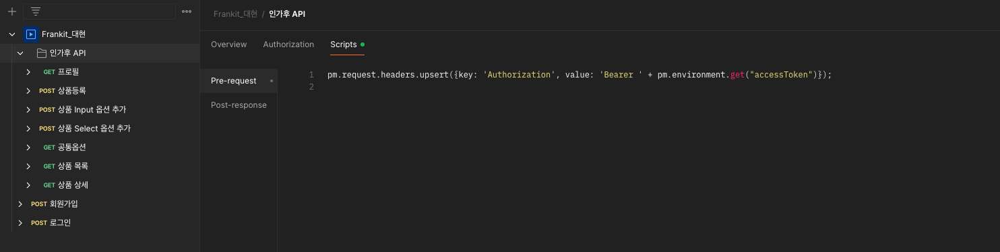

# Frankit 과제 수행 (백엔드 지원자 김대현)

| 사용 기술       | 버전    |
|-------------|-------|
| Spring Boot | 3.4.3 |
| Java        | 23    |

| IDE      |
|----------|
| IntelliJ |

## Demo URL

| url                   | https://frankit.tonglink.site         |
|-----------------------|------------|


# Docker Build
```shell
docker build --platform linux/amd64 -t frankit-task:0.0.1 .
docker run -d -p 8086:8080 frankit-task:0.0.1
```

# Jar Build
```shell
./gradlew bootJar
java -jar build/libs/FrankTaskJava-frankit-task-0.0.1.jar 
```


# 시연 영상


# On-Premise 배포 구조


# 패키지 구조
```java
src
└── main
    └── java
        └── shop
            └── frankit
                ├── common
                │   └── ... (하위 폴더 또는 파일)
                └── domain
                    ├── common
                    │   └── ... (하위 폴더 또는 파일)
                    ├── product
                    │   ├── controller
                    │   ├── dto
                    │   ├── entity
                    │   ├── repository
                    │   └── service
                    └── user
                        ├── controller
                        ├── dto
                        ├── entity
                        ├── repository
                        └── service
```

# 인증/인가 API 구분


# API 명세서 (Postman)
https://documenter.getpostman.com/view/42908804/2sAYdmn8S9#intro

로그인 성공 시 스크립트를 통해 포스트맨 환경변수에 저장


인가가 필요한 API들은 폴더 안에 실행 전에 헤더에 accessToken값을 넣는 것으로 설정



# 인증/인가
인증/인가에 대해서는 심플하게 AccessToken만 발급 받아서 토큰으로 인가처리하도록 구현하였습니다.
1. TokenAuthenticationFilter에서 Header에 토큰을 가져와서 검증 진행
2. 검증 성공 시 SecurityContextHolder에 인가 정보 저장
3. Filter단에서 Exception 발생 시 따로 아래와 같이 처리
```java
private static void handleException(HttpServletResponse response, ResultCode resultCode) throws IOException {
        response.setContentType("application/json;charset=UTF-8");
        response.setCharacterEncoding("utf-8");
        response.setStatus(HttpServletResponse.SC_UNAUTHORIZED);

        // JSON 직렬화 (Jackson 사용)
        String jsonResponse = objectMapper.writeValueAsString(Map.of(
                "code", resultCode.getCode(),
                "message", resultCode.getMessage()
        ));

        response.getWriter().print(jsonResponse);
    }
```

# Entity 설계 (ERD)


product - 상품 테이블

Product_option - 상품 옵션 테이블

common_option - SELECT 형태의 공통 옵션 ex : (의류 사이즈 옵션)

common_option_value - SELECT 형태의 공통 옵션의 값들 ex :  S, M, L, XL

common_option, common_option_value 테이블은 Application 실행시 만듬.

```java
// CommonOptionServiceImpl.class
@PostConstruct
public void init() {
    // 공통 옵션 1 생성
    if(commonOptionRepository.findByOptionName("의류 사이즈 옵션").isEmpty()) {
        CommonOption commonOption = commonOptionRepository.save(new CommonOption("의류 사이즈 옵션"));
        CommonOptionValue op1 = new CommonOptionValue("S", 0D);
        op1.setCommonOption(commonOption);
        commonOptionValueRepository.save(op1);
        CommonOptionValue op2 = new CommonOptionValue("M", 0D);
        op2.setCommonOption(commonOption);
        commonOptionValueRepository.save(op2);
        CommonOptionValue op3 = new CommonOptionValue("L", 0D);
        op3.setCommonOption(commonOption);
        commonOptionValueRepository.save(op3);
        CommonOptionValue op4 = new CommonOptionValue("XL", 0D);
        op4.setCommonOption(commonOption);
        commonOptionValueRepository.save(op4);
    }
    // 공통 옵션 2 생성
    if(commonOptionRepository.findByOptionName("나무 젓가락 묶음 판매").isEmpty()) {
        CommonOption commonOption = commonOptionRepository.save(new CommonOption("나무 젓가락 묶음 판매"));
        CommonOptionValue op1 = new CommonOptionValue("10 묶음", 500D);
        op1.setCommonOption(commonOption);
        commonOptionValueRepository.save(op1);
        CommonOptionValue op2 = new CommonOptionValue("50 묶음", 2500D);
        op2.setCommonOption(commonOption);
        commonOptionValueRepository.save(op2);
        CommonOptionValue op3 = new CommonOptionValue("100 묶음", 5000D);
        op3.setCommonOption(commonOption);
        commonOptionValueRepository.save(op3);
    }
}
```

# 추가 고려 사항
1. JPA의 문제점인 N+1 을 해결하기 위해 QueryDsl을 사용하여 FethJoin을 이용하여 해결
2. 결합도를 느슨하게 하기 위해 Layer별로 DTO를 다르게 구성하였습니다. DTO 갯수가 많지않아 따로 Converter Class를 생성하지 않고 DTO에서 변환하도록 진행하였습니다.

# Unit Test
퇴근 후 작업으로 시간이 부족해 Create에 대해서만 단위테스트를 진행하였습니다. test 하위 폴더에 구현해두었습니다.

# Exception 처리
ControllerAdvice를 이용해서 예외 전역처리를 진행했습니다.
```java
@RestControllerAdvice
public class GlobalExceptionHandler {
    private static final ResponseEntity<ExceptionMsg> GENERIC_ERROR = new ResponseEntity<>(
            new ExceptionMsg(ResultCode.ERROR.getMessage(), ResultCode.ERROR.getCode(), false, List.of()),
            HttpStatus.BAD_REQUEST
    );

    @ExceptionHandler(ApiErrorException.class)
    public ResponseEntity<ExceptionMsg> handleApiErrorException(ApiErrorException ex) {
        return new ResponseEntity<>(
                new ExceptionMsg(ex.getResultCode().getMessage(), ex.getResultCode().getCode(), false, List.of()),
                HttpStatus.BAD_REQUEST
        );
    }

    @ExceptionHandler(MethodArgumentNotValidException.class)
    public ResponseEntity<ExceptionMsg> handleMethodValidException(MethodArgumentNotValidException ex) {
        List<FieldErrorDetail> errors = ex.getBindingResult().getAllErrors().stream()
                .map(error -> new FieldErrorDetail(((FieldError) error).getField(), error.getDefaultMessage()))
                .toList();

        return new ResponseEntity<>(
                new ExceptionMsg(ResultCode.INVALID_PARAMETER.getMessage(), ResultCode.INVALID_PARAMETER.getCode(), false, errors),
                HttpStatus.OK
        );
    }

    @ExceptionHandler(HttpMessageNotReadableException.class)
    public ResponseEntity<ExceptionMsg> handleHttpMessageNotReadableException(HttpMessageNotReadableException ex) {
        Throwable rootCause = ex.getCause();
        List<FieldErrorDetail> errors = switch (rootCause) {
            case InvalidFormatException formatException -> formatException.getPath().stream()
                    .map(reference -> new FieldErrorDetail(reference.getFieldName(), "[" + reference.getFieldName() + "] 가 타입이 올바르지 않습니다."))
                    .toList();
            case JsonMappingException mappingException -> mappingException.getPath().stream()
                    .map(reference -> new FieldErrorDetail(reference.getFieldName(), "[" + reference.getFieldName() + "] 가 누락되었습니다."))
                    .toList();
            default -> List.of(new FieldErrorDetail("", rootCause != null ? rootCause.getMessage() : "에러 발생"));
        };

        return new ResponseEntity<>(
                new ExceptionMsg(ResultCode.INVALID_PARAMETER.getMessage(), ResultCode.INVALID_PARAMETER.getCode(), false, errors),
                HttpStatus.OK
        );
    }

    @ExceptionHandler(MissingServletRequestParameterException.class)
    public ResponseEntity<ExceptionMsg> handleMissingServletRequestParameterException(MissingServletRequestParameterException ex) {
        return new ResponseEntity<>(
                new ExceptionMsg(
                        ResultCode.INVALID_PARAMETER.getMessage(),
                        ResultCode.INVALID_PARAMETER.getCode(),
                        false,
                        List.of(new FieldErrorDetail(ex.getParameterName(), ex.getMessage()))
                ),
                HttpStatus.OK
        );
    }

    @ExceptionHandler(MethodArgumentTypeMismatchException.class)
    public ResponseEntity<ExceptionMsg> handleTypeMismatch(MethodArgumentTypeMismatchException ex) {
        String message = ex.getRequiredType() != null && ex.getRequiredType().isEnum()
                ? "유효한 값: " + List.of(ex.getRequiredType().getEnumConstants()).toString()
                : "Invalid value for parameter '" + ex.getName() + "'";

        return new ResponseEntity<>(
                new ExceptionMsg(
                        ResultCode.INVALID_PARAMETER.getMessage(),
                        ResultCode.INVALID_PARAMETER.getCode(),
                        false,
                        List.of(new FieldErrorDetail(ex.getName(), message))
                ),
                HttpStatus.OK
        );
    }

    @ExceptionHandler(Exception.class)
    public ResponseEntity<ExceptionMsg> handleException(Exception ex) {
        ex.printStackTrace();
        return GENERIC_ERROR;
    }
}

```

# Logging 처리
Interceptor를 생성하여 로깅처리를 진행했습니다.

Client의 요청과 파라미터를 수집하고 응답 코드를 수집합니다.
```java
@Slf4j
@Component
public class RequestLoggingInterceptor implements HandlerInterceptor {

    @Override
    public boolean preHandle(HttpServletRequest request, HttpServletResponse response, Object handler) throws Exception {
        String method = request.getMethod();
        String uri = request.getRequestURI();
        String queryString = (request.getQueryString() != null) ? "?" + request.getQueryString() : "";

        // 요청 파라미터 추출
        Map<String, String[]> parameterMap = request.getParameterMap();
        String parameters = parameterMap.entrySet().stream()
                .map(entry -> entry.getKey() + "=" + String.join(",", entry.getValue()))
                .collect(Collectors.joining(", "));

        log.info("[URL:" + uri + queryString + "] [METHOD:" + method + "] [PARAMETERS:{" + parameters + "}] [STATUS:" + response.getStatus() + "]");

        return true; // 요청 처리를 계속 진행
    }
}
```

